# Todo app Instructions
The goal of this project is to create a TODO app using JavaScript and its paradigms.
****

## App Features

When the app is opened, first it shows the icon of the app.
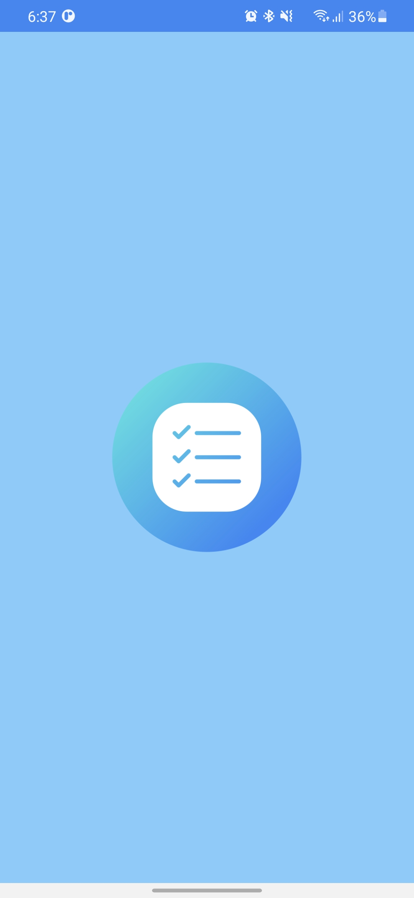
*Fig: Front page when starting the app*
\
&nbsp;
****
### Adding Task
Task can be added by clicking on the blue button as shown in the figure below.
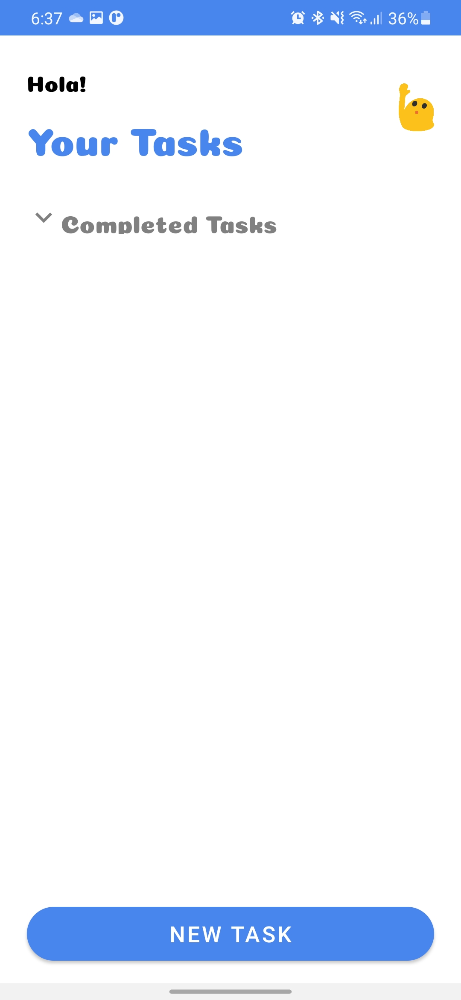
*Fig: The layout out of the activity before adding any task*
\
&nbsp;

After clicking on the blue button the app goes to second activity where task can be added along with task description, priority, date and time to complete.
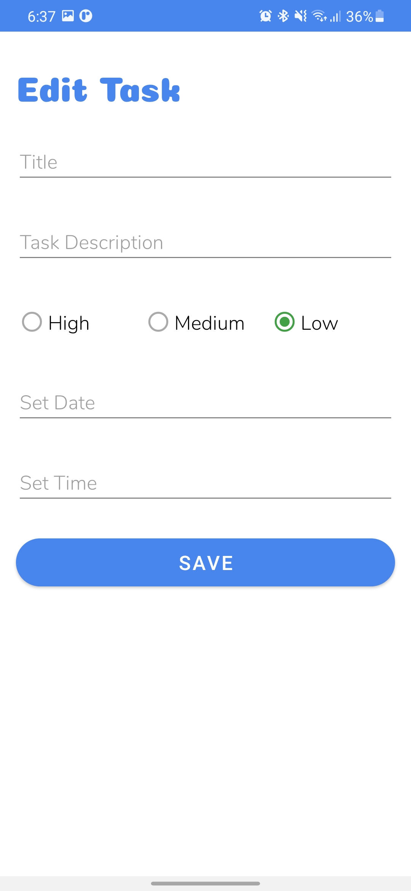
*Fig: The second layout to add tasks*
\
&nbsp;
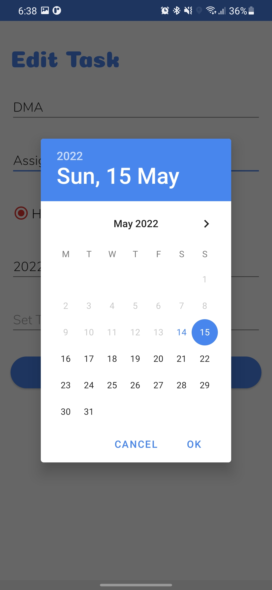
*Fig: To select the desired date*
\
&nbsp;
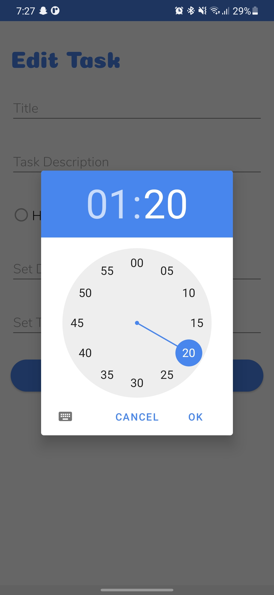
*Fig: To select the desired date*
\
&nbsp;
After all the feilds are set then save button shoul be clicked to save the task.
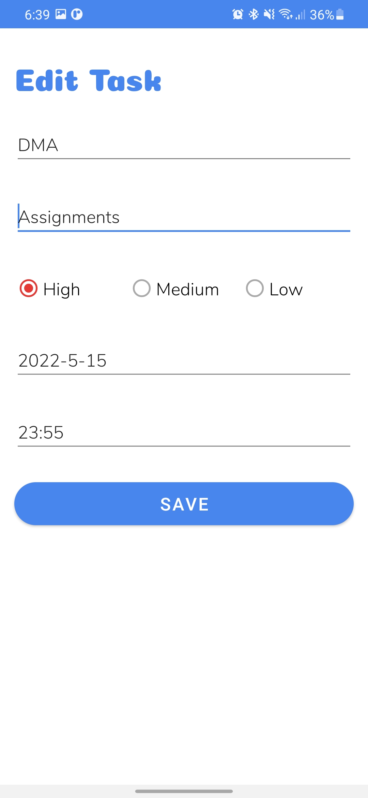
*Fig: Task is filled*
\
&nbsp;
****
### Your Task
As illustrated in the diagram below, the task added will be visible in the main activity.

*Fig: The added task*
\
&nbsp;
The task added will be placed according to its proirity. The High priority having red color will be placed first. followed by medium priority having yellow color is placed and lastly, the low priority with green color will be placed at last.
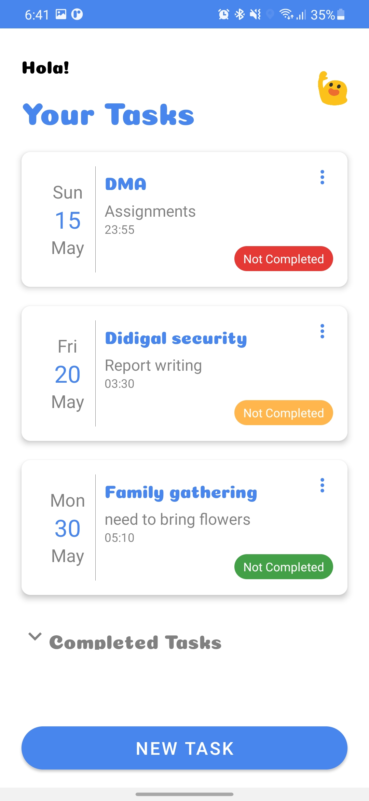
*Fig: The task added are assembled as it priority*
\
&nbsp;
If a task has to be eliminated, swipe it to the left, and if it needs to be amended, slide it to the right.
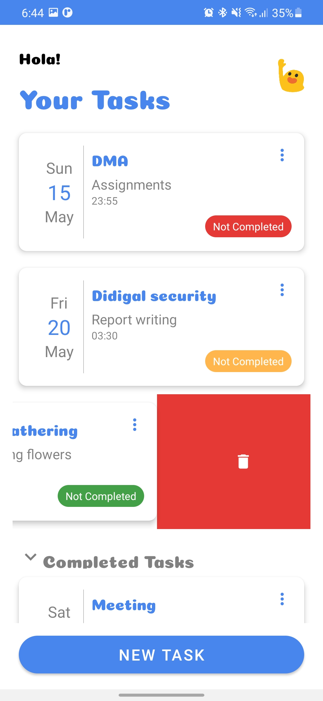
*Fig: To delete the task*
\
&nbsp;
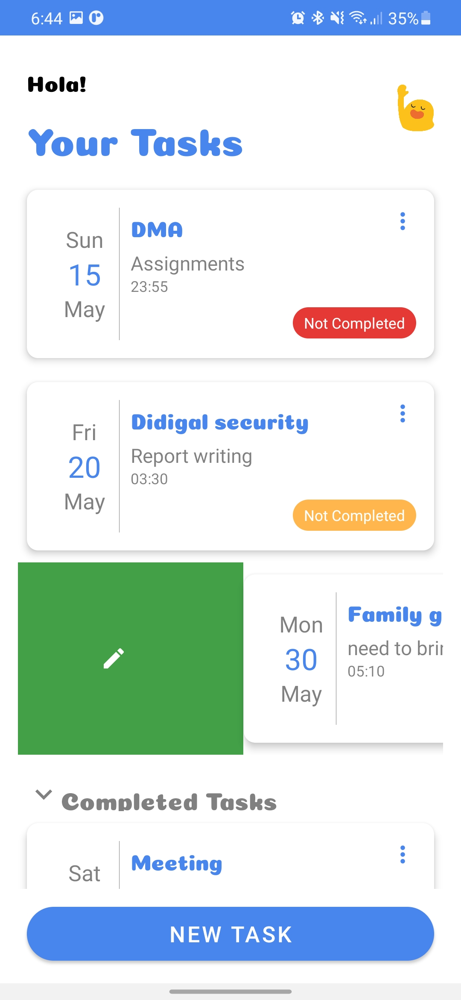
*Fig: To update the task*
\
&nbsp;
****
When the task is finished, click the "not completed" button on the right. That will send the task under Completed Task panel.
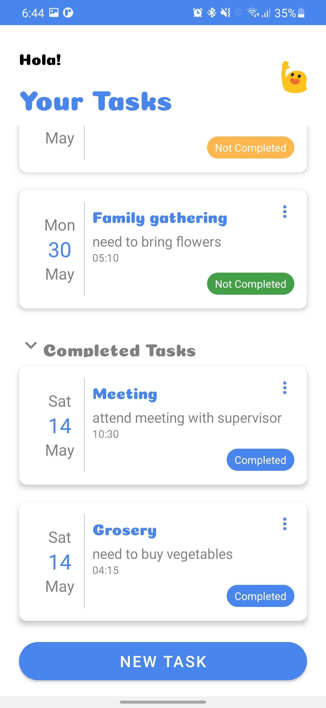
*Fig: Showing completed task*
\
&nbsp;

## Full demonstration of the app
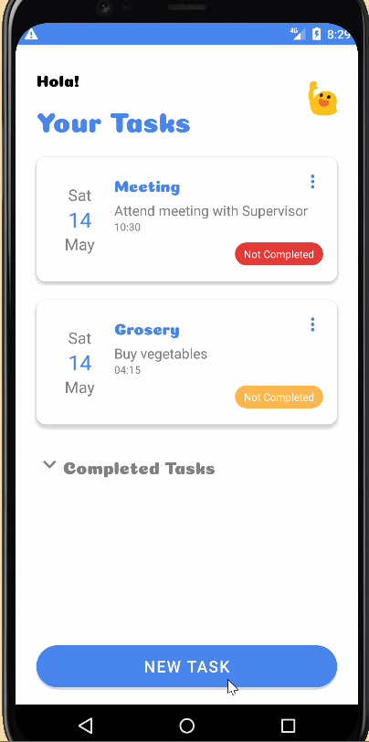
*Fig: Full Todo app demonstration.*